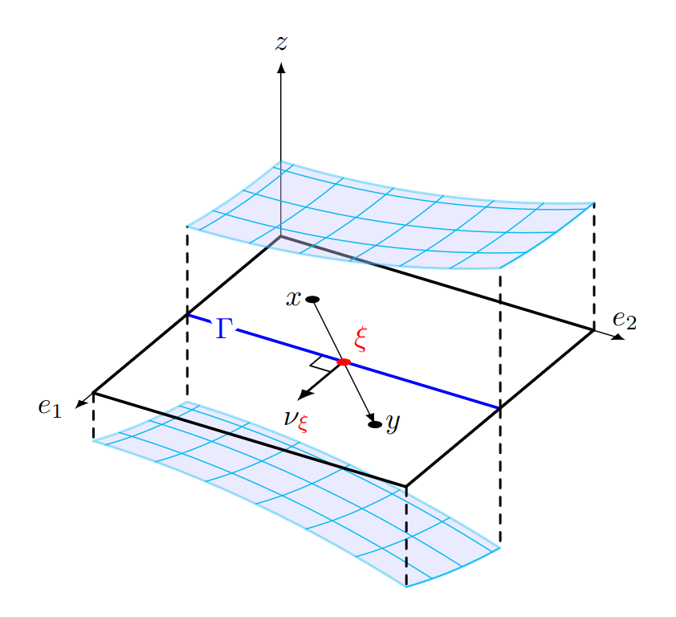

Intégration
===========

.. definition:: Title

   This is the content of the definition admonition.

.. proof:definition:: Right triangle

   A *right triangle* is a triangle in which one angle is a right angle.

.. toctree::
  :maxdepth: 1

  01-une_propriete_geometrique_de_l_integrale
  02-lemme_de_lebesgue
  03-calculs_approches_d_integrales
  test